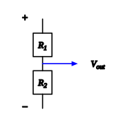

::: card
Two configurations appear so often they deserve names. A **voltage divider** solves a common
problem: you have a supply and need a lower fraction of it. Put two resistors in series across
the supply and tap the output at the junction between them.

:::

::: card
There is one path, so the same current flows through both, and the output sits directly across
$R_2$.[voltage divider](reference:voltage-divider)

$$ V_\text{out} = V_\text{in} \cdot \frac{R_2}{R_1 + R_2} $$

The larger resistor always takes the larger share, in direct proportion.
:::

::: card
This assumes almost nothing is drawn from the output. Connect a load and it sits in parallel
with $R_2$, shrinking the effective bottom resistance and pulling $V_\text{out}$ below the simple
fraction. The Thévenin method is how you handle that properly.
:::

::: card
A **current divider** is the parallel version: a total current arrives at a junction and splits.
Both branches span the same two nodes, so both see the same voltage.[current divider](reference:current-divider)

$$ I_1 = I_\text{total} \cdot \frac{R_2}{R_1 + R_2} $$
:::

::: card
The $R_2$ in the numerator for $I_1$ looks backwards but is right: the easier a branch is, the
more current it takes, so $I_1$ is governed by how easy the *other* branch is. A near-zero $R_2$
steals almost all the current. That is why a short across a load is dangerous: it drops the
parallel resistance to near zero and redirects nearly all the current through the fault.
:::

::: exercise q1
A voltage divider has $R_1 = 18$ kΩ and $R_2 = 2$ kΩ, fed from 10 V. What is $V_\text{out}$?

::: answer
1 V. $V_\text{out} = 10 \times 2/(18 + 2) = 1$ V.
:::
:::

::: exercise q2
Two resistors in parallel, $R_1 = 10$ Ω and $R_2 = 40$ Ω, carry a total of 5 A. How much flows
through each?

::: answer
$I_1 = 4$ A and $I_2 = 1$ A. Each branch takes the share set by the *other* resistor:
$I_1 = 5 \times 40/(10+40)$, $I_2 = 5 \times 10/(10+40)$. The smaller resistor takes the larger
share.
:::
:::

::: reference current-divider
# Current divider

A current arriving at two parallel branches splits between them. The share through one branch is
set by the *other* branch's resistance.

::: equation
I_1 = I_\text{total} \cdot \frac{R_2}{R_1 + R_2}
:::

::: legend
$I_1$: current in the first branch, in amperes
$I_\text{total}$: total current into the junction, in amperes
$R_1$: first branch resistance, in ohms
$R_2$: other branch resistance, in ohms
:::

::: derivation
Both branches span the same two nodes, so both see the same voltage $V$: $I_1 = V/R_1$ and
$I_2 = V/R_2$.
The total is $I_\text{total} = V\left(\dfrac{1}{R_1} + \dfrac{1}{R_2}\right) = V\,\dfrac{R_1 + R_2}{R_1 R_2}$.
Solve for $V$ and substitute into $I_1 = V/R_1$:
$I_1 = I_\text{total} \cdot \dfrac{R_2}{R_1 + R_2}$. ∎

It rests on [Ohm's law](reference:ohms-law), [Resistances in parallel](reference:parallel-resistance), [Kirchhoff's current law](reference:kcl).
:::
:::

::: reference voltage-divider
# Voltage divider

Two resistors in series across a supply tap a fraction of it at their junction. The output is the
supply scaled by the bottom resistor's share.

::: equation
V_\text{out} = V_\text{in} \cdot \frac{R_2}{R_1 + R_2}
:::

::: legend
$V_\text{out}$: output voltage, in volts
$V_\text{in}$: input voltage, in volts
$R_1$: first resistor, in ohms
$R_2$: second (output) resistor, in ohms
:::

::: derivation
The two resistors form one series path, so the same current flows: $I = V_\text{in}/(R_1 + R_2)$.
The output sits directly across $R_2$, so it is the drop there: $V_\text{out} = I R_2$.
Substituting $I$: $V_\text{out} = V_\text{in} \cdot \dfrac{R_2}{R_1 + R_2}$. ∎

It rests on [Ohm's law](reference:ohms-law), [Resistances in series](reference:series-resistance), [Kirchhoff's voltage law](reference:kvl).
:::
:::
