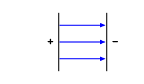

::: card
A single positive charge sends field lines radiating outward in all directions, weakening with
distance. A negative charge draws them inward. Two opposite charges sitting together largely
cancel their fields: the two sets of lines point opposite ways and subtract, leaving almost no
net field around them.
:::

::: card
Separate those charges and the cancellation is lost. Between them, both fields point the same
way and add. More field now occupies space than when the charges were together, and creating
that extra field required work. That work is stored in the field itself, distributed across the
volume it occupies. The energy is physically there.
:::

::: card
This is why opposite charges attract: the together state has less field, and less energy.
Releasing them lets the system fall to the lower-energy configuration, the same way a ball rolls
downhill.
:::

::: card
A capacitor exploits this directly. Two large plates, close together, one positive and one
negative, trap a strong uniform field in the gap between them.

:::

::: card
The energy lives in that field, in the space between the plates, not in the plates themselves.
Disconnect the battery and the field persists, held in place by the charge imbalance, ready to
do work when the charges are given a path to recombine.
:::

::: exercise q1
Two positive charges are pushed toward each other. Does the total electric field energy in space
increase or decrease?

::: answer
It increases. Same-sign charges have fields that point the same way between them and add, so
pushing them closer enlarges that reinforced region, which takes work and is stored as field
energy.
:::
:::

::: exercise q2
A capacitor is charged and then disconnected from the battery. Where is the energy stored?

::: answer
In the electric field between the plates, not in either plate alone. The charge imbalance
maintains the field, and the field holds the energy.
:::
:::